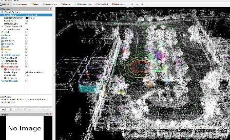
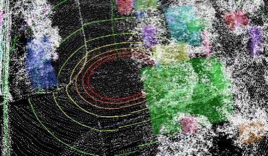
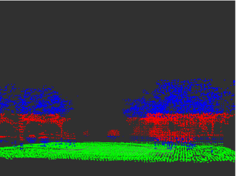

# ROS/PCL 激光雷达点云感知：RANSAC 地面分割与障碍物聚类

基于 ROS Noetic、C++14 与 PCL 的激光雷达点云处理项目。核心功能是订阅 `sensor_msgs/PointCloud2`，依次完成 ROI 过滤、体素下采样、RANSAC 地面分割、非地面障碍物欧几里得聚类，并在 RViz 中发布彩色点云、边界框和距离标注。

仓库还包含 PCD 离线实验程序、RViz 配置、Unity 场景与语义地图导出数据。Unity 数据用于地图数据准备与后续扩展，不是默认实时点云节点的直接输入。

## 实时点云处理链路

```text
/velodyne_points（或指定 PointCloud2 话题）
        │
        ▼
ROI PassThrough（X / Y / Z）
        │
        ▼
VoxelGrid 下采样
        │
        ▼
RANSAC 平面拟合 ──► ground
        │
        ▼
非地面点 ──► KdTree + 欧几里得聚类 ──► clusters + MarkerArray
```

主节点为 `lidar_perception_node`，其输入和处理参数由 `lidar_perception.launch` 提供。节点使用私有命名空间发布以下结果：

| 话题后缀 | 内容 |
| --- | --- |
| `downsampled` | ROI 过滤和下采样后的点云。 |
| `ground` | RANSAC 平面内点。 |
| `obstacles` | 去除地面后的非地面点。 |
| `clusters` | 按聚类着色后的障碍物点云。 |
| `markers` | 聚类包围盒和距离文字的 `MarkerArray`。 |

默认 launch 节点名为 `lidar_perception_node`，因此未重映射时实际话题位于 `/lidar_perception_node/` 命名空间下。

## 实现模块

### 1. 实时处理节点

`lidar_perception/src/lidar_perception_node.cpp` 处理实时 `PointCloud2`：

1. 通过三次 `PassThrough` 限制 X/Y/Z ROI；
2. 以 `VoxelGrid` 降低点数；
3. 使用 `SACSegmentation` 的 `SACMODEL_PLANE` 与 `SAC_RANSAC` 分离地面；
4. 使用 `ExtractIndices` 得到障碍物点云；
5. 以 KdTree 和 `EuclideanClusterExtraction` 聚类；
6. 计算每个聚类的包围盒、质心与距离，发布着色点云和 `MarkerArray`。

### 2. PCD 地面分割实验

`pcd_ground_segmentation.cpp` 读取单个 PCD 文件，执行 ROI 过滤和 RANSAC 平面拟合，并按高度将非地面点分为树木与其他点。程序发布：

| 话题 | 颜色 / 内容 |
| --- | --- |
| `/ground_cloud` | 绿色地面点。 |
| `/trees_cloud` | 红色树木点。 |
| `/other_cloud` | 蓝色其他非地面点。 |
| `/segmented_cloud` | 三类点的合并结果。 |

### 3. 实时聚类与边界框实验

`pcd_clustering.cpp` 默认订阅 `/velodyne_points`，执行独立的下采样、ROI、RANSAC 与欧几里得聚类流程，发布：

- `/detected_clusters`：彩色聚类点云；
- `/cluster_markers`：包围盒和距离文字；
- 可通过私有参数 `input_topic`、`frame_id` 调整输入话题和坐标系。

## 运行截图

以下图片来自课程运行记录，用于展示 RViz 中的原始点云、聚类和分割效果，不作为算法精度、速度或泛化能力的量化结论。

| 原始点云 RViz 视图 | 障碍物聚类视图 |
| --- | --- |
|  |  |

| RANSAC 地面分割结果 |
| --- |
|  |

## 参数配置

`lidar_perception/launch/lidar_perception.launch` 的默认参数如下：

| 参数 | 默认值 | 作用 |
| --- | ---: | --- |
| `input_topic` | `/velodyne_points` | 输入点云话题。 |
| `voxel_leaf_size` | `0.1 m` | VoxelGrid 体素边长。 |
| `ground_threshold` | `0.3 m` | RANSAC 平面距离阈值。 |
| `cluster_tolerance` | `0.5 m` | 欧几里得聚类距离阈值。 |
| `min_cluster_size` | `50` | 最小聚类点数。 |
| `max_cluster_size` | `25000` | 最大聚类点数。 |
| ROI | X/Y `[-50, 50]`，Z `[-2, 3]` m | 实时节点保留的空间范围。 |

参数需要随雷达线数、点密度、安装高度、场景尺度和目标尺寸调整；仓库中的数值是课程实验配置，不代表通用最优参数。

## 构建与运行

将仓库置于 catkin 工作空间后编译：

```bash
mkdir -p ~/catkin_ws/src
cd ~/catkin_ws/src
git clone https://github.com/haimichenha/rviz-RANSAC-.git
cd ~/catkin_ws
catkin_make
source devel/setup.bash
```

### 实时点云节点

```bash
# 默认订阅 /velodyne_points，并打开 RViz
roslaunch lidar_perception lidar_perception.launch

# 指定输入点云话题
roslaunch lidar_perception lidar_perception.launch input_topic:=/your_points_topic

# 回放 rosbag
roslaunch lidar_perception lidar_perception.launch bag_file:=/path/to/your.bag
```

### 离线 PCD 实验

```bash
# 对包内样例 PCD 进行地面分割
rosrun lidar_perception pcd_ground_segmentation "$(rospack find lidar_perception)/data/auto.pcd"

# 对实时输入执行聚类与边界框显示
rosrun lidar_perception pcd_clustering _input_topic:=/velodyne_points _frame_id:=camera_init
```

## Unity 场景与语义地图数据

`unity/again.unity` 与 [`docs/semantic_map.md`](docs/semantic_map.md) 保留 Unity 场景和语义地图导出数据说明：

| 文件 | 内容 |
| --- | --- |
| `docs/data/semantic_map/lane.csv` | 车道拓扑、前后继与限速等信息。 |
| `docs/data/semantic_map/dtlane.csv` | 车道中心线采样点、方向、坡度等属性。 |
| `docs/data/semantic_map/roadedge.csv` | 道路边界或路沿关联信息。 |
| `docs/data/semantic_map/auto.pcd` | 点云地图数据快照。 |

这些文件属于 Unity 地图标注与数据准备材料。若要在 ROS 中使用，需要自行补充格式转换或加载脚本；它们不会由 `lidar_perception_node` 自动读取。

## 目录结构

```text
.
├── lidar_perception/
│   ├── data/auto.pcd                       # PCD 离线实验样例
│   ├── launch/lidar_perception.launch      # 实时处理启动文件
│   ├── rviz/lidar_perception.rviz          # RViz 配置
│   └── src/
│       ├── lidar_perception_node.cpp        # 实时处理主节点
│       ├── pcd_ground_segmentation.cpp      # PCD 地面分割
│       └── pcd_clustering.cpp               # 实时聚类与边界框
├── unity/again.unity                        # Unity 场景文件
└── docs/
    ├── assets/                              # README 运行截图
    ├── data/semantic_map/                   # Unity 语义地图导出数据
    ├── semantic_map.md
    └── 机器人开发实训报告.docx
```

## 技术栈与边界

- ROS Noetic、C++14、PCL、`pcl_ros`、`pcl_conversions`、RViz；
- `sensor_msgs/PointCloud2`、`visualization_msgs/MarkerArray`、PCD、rosbag；
- 代码实现点云预处理、平面分割、聚类与可视化，不包含目标分类、跟踪或完整车辆控制闭环；
- 部分资料来自课程实验记录；运行前应核对 ROS 依赖、输入坐标系和真实/回放点云话题。
