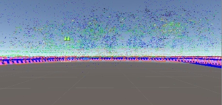
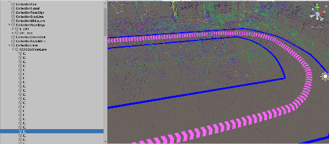

# Unity 语义地图与企业雷达车路径跟随

本页说明本仓库中 Unity 场景、语义地图导出数据与企业雷达车路径跟随之间的关系。它补充项目集成范围，不替代 `lidar_perception/` 中可直接阅读的 ROS/PCL 点云处理源码。

## 集成目标

项目使用 Unity 场景和语义地图数据准备车道/道路信息，并将相关地图数据用于企业雷达车的自动驾驶路径跟随。车辆根据既定道路或车道路径执行自动行驶；点云感知侧用于处理雷达点云、分离地面和障碍物，并在 RViz 中观察结果。

## 数据与系统位置

```text
Unity 场景（unity/again.unity）
        │
        ├── 车道与道路语义导出：lane.csv / dtlane.csv / roadedge.csv
        └── 点云地图：auto.pcd
                    │
                    ▼
企业雷达车的地图与路径跟随系统
                    │
                    ▼
自动驾驶沿既定路径行驶

PointCloud2 ──► lidar_perception ──► 地面 / 障碍物 / 聚类 / RViz
```

## 归档数据

| 位置 | 内容 | 在集成中的作用 |
| --- | --- | --- |
| `unity/again.unity` | Unity 场景文件 | 语义地图与道路场景来源。 |
| `docs/data/semantic_map/lane.csv` | 车道拓扑、前后继、限速等 | 路径/车道结构数据。 |
| `docs/data/semantic_map/dtlane.csv` | 车道中心线采样点、方向、坡度等 | 路径几何数据。 |
| `docs/data/semantic_map/roadedge.csv` | 道路边界或路沿关联 | 道路边界数据。 |
| `docs/data/semantic_map/auto.pcd` | 点云地图快照 | 地图和点云实验资料。 |
| `lidar_perception/` | ROS/PCL 点云处理节点与 PCD 实验 | 感知侧预处理、地面分割、聚类和可视化。 |

## 场景记录

| Unity 点云/道路视图 | Unity 车道语义视图 |
| --- | --- |
|  |  |

这些图片来自课程运行记录，用于说明场景与车道语义数据，不作为车辆跟随误差、定位精度或安全性能的量化证明。

## 可复现边界

- **仓库可直接核对**：Unity 场景文件、CSV/PCD 导出数据、ROS/PCL 点云感知节点、PCD 实验程序与 RViz 可视化配置。
- **项目记录确认**：语义地图数据用于企业雷达车自动驾驶路径跟随。
- **未包含内容**：企业雷达车硬件驱动、地图加载适配、路径跟随控制器、部署参数、现场日志和完整车辆工程。因此，本仓库不能单独复现整车自动驾驶过程。

如需继续整理，应补充车辆侧接口、数据格式转换、路径消息定义、控制频率和现场验证记录，再将其与本页的数据来源建立链接。
